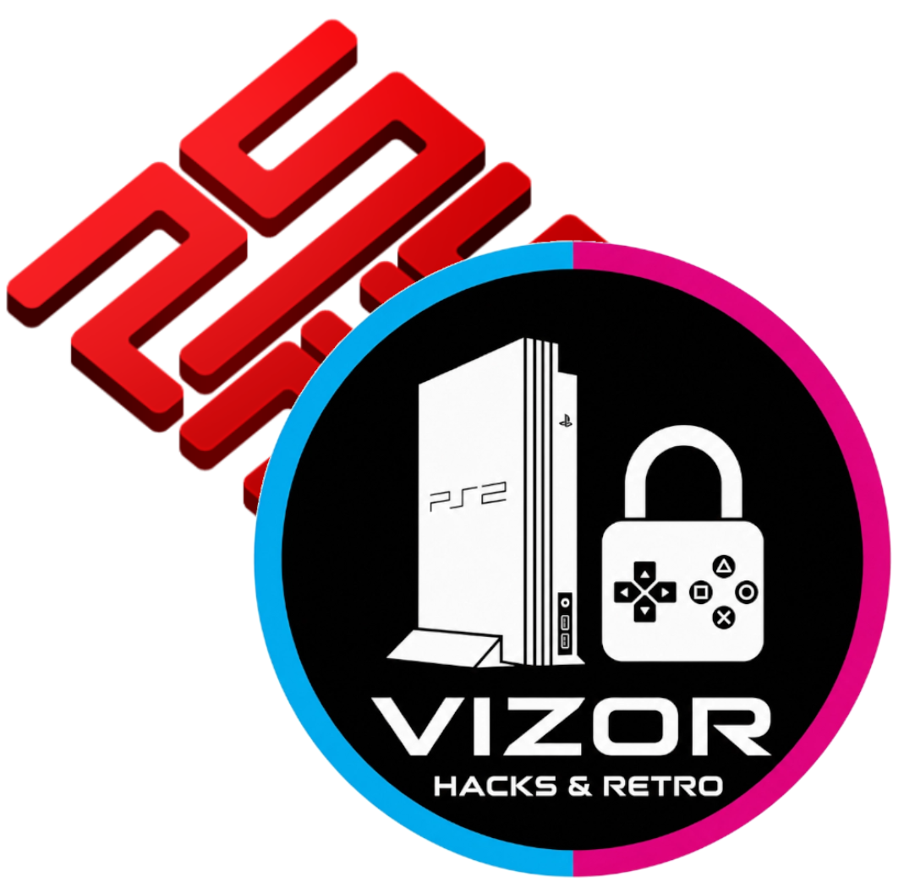

  

<h1 align="center">ViZoRRetrogames - PCSX2x6 Ultimate Launcher</h1>

  <strong>Un lanzador arcade optimizado para sistemas SYSTEM246 y SYSTEM256 usando PCSX2x6.</strong>

---
## Referencias

* Programa creado para ayudar al proyecto principal https://ps2homebrew-arcade.github.io/pcsx2x6/ de https://github.com/PS2Homebrew-arcade y facilitar la instalación de los juegos con solo indicar el propio juego y la memory card.
* El lanzador incluye la carpeta proverb Game library Template.

## 🚀 Características

* 🎛️ **Arquitectura Automatizada**: Vincula tus imágenes de juego (.CHD, .ISO, .BIN) y archivos de seguridad dongle (.BIN) al instante.
* 📂 **Estructura Dinámica**: Lee automáticamente las IDs de tus juegos desde la carpeta `proverb/bin`.
* 🖥️ **Diseño Industrial**: Interfaz oscura personalizada con estética arcade basada en `CustomTkinter`.
* 💾 **Persistencia**: Recuerda tus últimas rutas configuradas para abrir y jugar en segundos.

## 📺 Mi Canal de Youtube

Canal de YouTube --> https://www.youtube.com/@ViZoRRetrogames

## 📺 Videotutorial y Guía de Instalación

💾 **Haz clic en la imagen de abajo para reproducir el tutorial en YouTube:**

## 🛠️ Requisitos previos

Para ejecutar el código fuente o el compilado necesitas:
* **PCSX2** (Versión Qt compatible con argumentos `.acgame`).
* La estructura de carpetas `proverb/bin/` en el mismo directorio.

